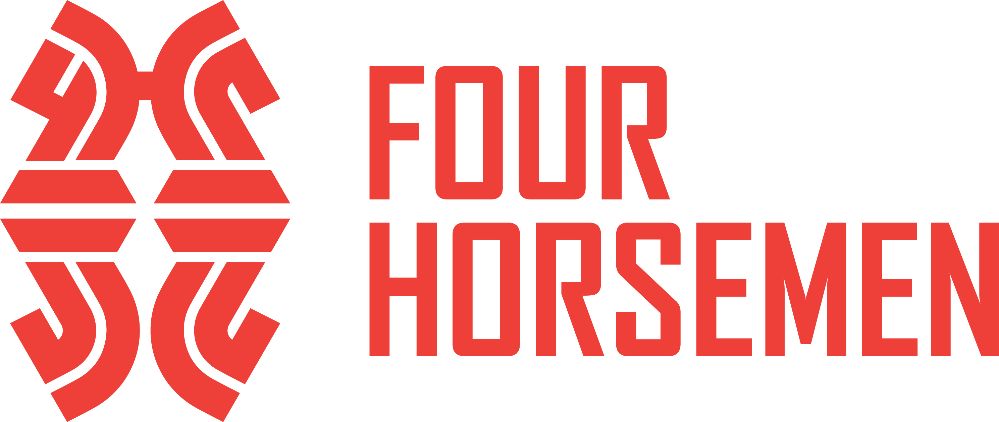
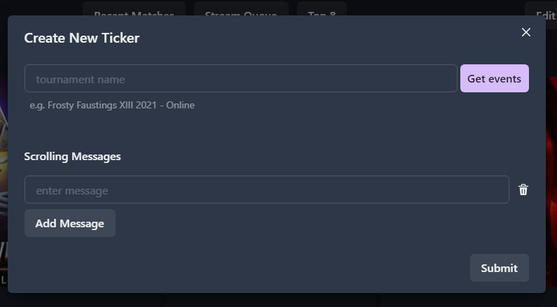
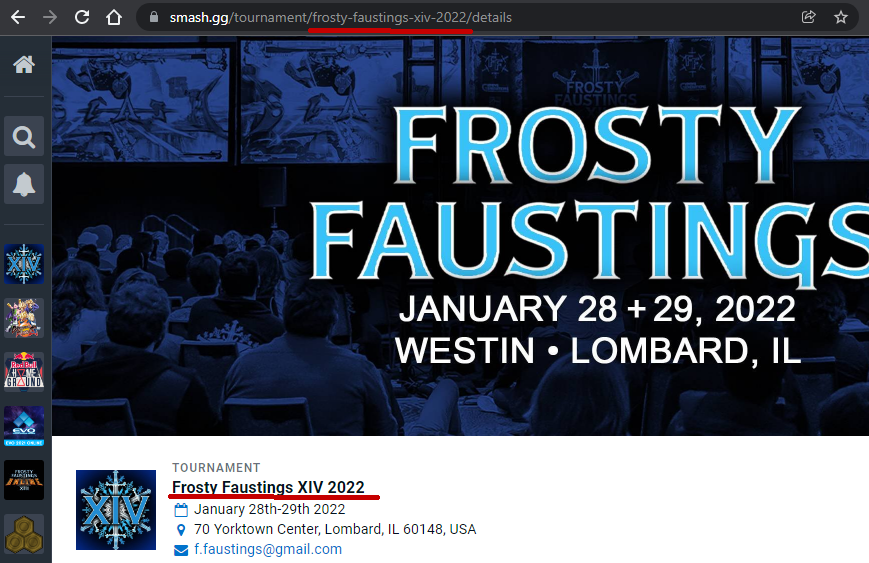
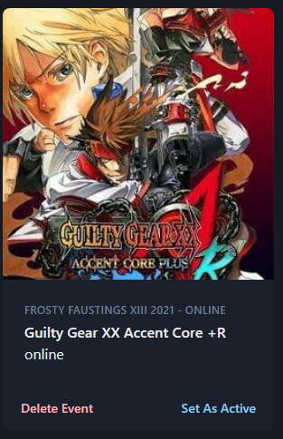
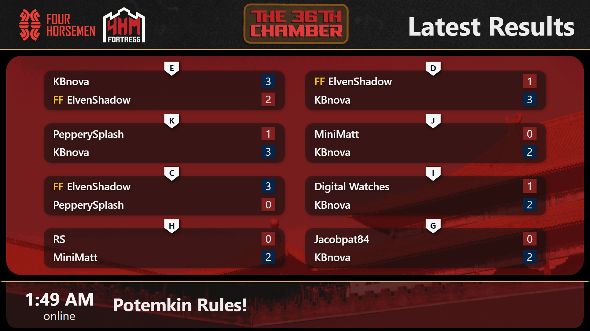
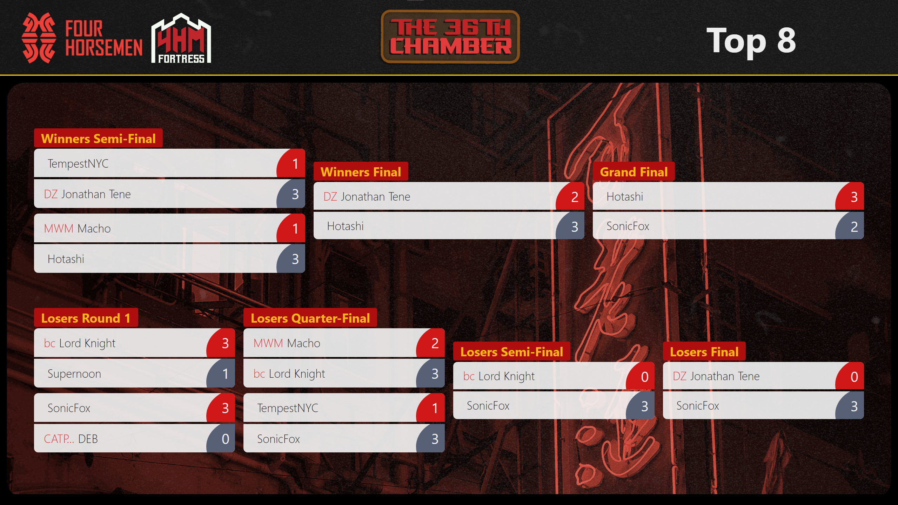

# Four Horsemen Tournament Ticker

The Four Horsemen Tournament Ticker is a web application that provides dynamically populated stream views by leveraging data from [smash.gg's GraphQL API](https://developer.smash.gg/docs/intro).

## Running the application

After forking and cloning the repo, first install dependencies with `npm install` and open up a dev environment by running `npm start`.

# How to Use the Ticker

### The Landing Page

For first time or signed out users, the application will take you to a landing page where you will need to sign in with a google account as well as input an admin password. For this build of the application, the password is `RedMonitorGrapefruit` .

### The Dashboard

Once you've successfully logged in, you'll be directed to the dashboard where you can navigate to the three currently available views (recent matches, Stream Queue and Top 8), create and delete events , and edit the theme of your views.

### Creating a New Event

1. Click the `Create new ticker` button on the dashboard and a modal will open and allow you to choose which event in a tournament to track.

2. copy paste the name of your tournament as it appears on the smash.gg page or from the url on its page. While copying the tournament name as it appears on the page works and will be formatted for the query to the api, the more fool proof approach is to use the slug in the url.

   For example, in `https://smash.gg/tournament/frosty-faustings-xiv-2022/details`,\
   you would use `frosty-faustings-xiv-2022`.

   <figure>
   

   </figure>

3. Click `Get Events`. A `Select Event` button will appear if the tournament name/slug provided is valid. From the dropdown, select the event you wish to track.

4. Input any messages you would like to display in the footer section of the `Recent Matches` view. You can add as many as you'd like and they will cycle in order every 8 seconds.

5. Click submit and a shiny new event card will be created and show up on the dashboard!

<figure>

</figure>

6. click `Set As Active` on the event card and you are now tracking your event!

## Editing your Theme

You can edit the theme of your views in a number of ways. Currently, you can change the background of each view and up to three logos that will appear in the header - two logos to the left of the header for things sponsors or organizations, and a centered logo for your event.

Click the `Edit Theme` button to bring up a modal to customize your event.
From here, you'll be able upload images and select from backgrounds and logos you've updated.

## The Views

Now that you've created the event you'd like to track, click one of the three views in the upper middle of the dashboard. The views that you can choose to display are:

1. The `Recent matches` view that shows the most recently completed matches in the event.

<figure>

</figure>

2. The `Stream queue` view that will display which matches are on deck to be broadcasted on stream. You won't see matches in this view unless you add streams and create stations on smash.gg. [More on that here](https://help.smash.gg/en/articles/1465692-adding-streams-and-creating-stations).

<figure>

</figure>

3. The `Top 8 view` that will display the current state of the top 8 bracket of double elimination tournaments.

<figure>

</figure>
